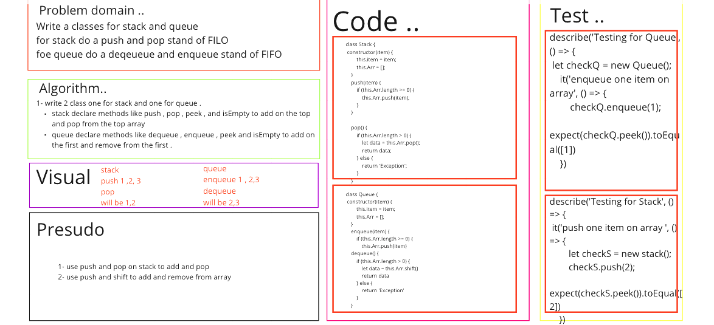
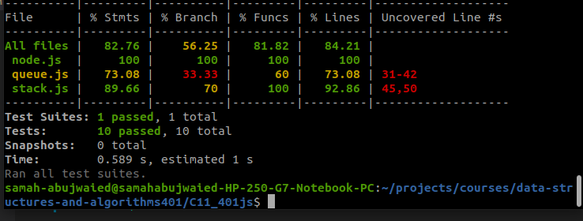

# Stack & Queue

### Challenge:
- Write a classes for stack and queue

##### Approach
1. I understood the problem first
2. I imagined how the results should be
3. I made a drawings of the stack and queue will be if we need to push or pop from them. 
4. I wrote the code
5. I made the tests

##### Efficiency

Stack & Queue
Time : O(1)

##### Test

npm run test

##### Whiteboard :

