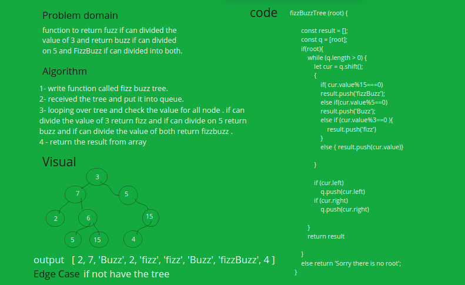
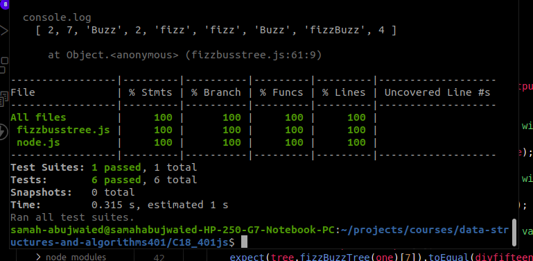

# Challenge Summary

    Write a function called fizz buzz tree
    Arguments: k-ary tree
    Return: new k-ary tree

## Whiteboard Process

## Approach & Efficiency
O(n) test and space 
## Solution

