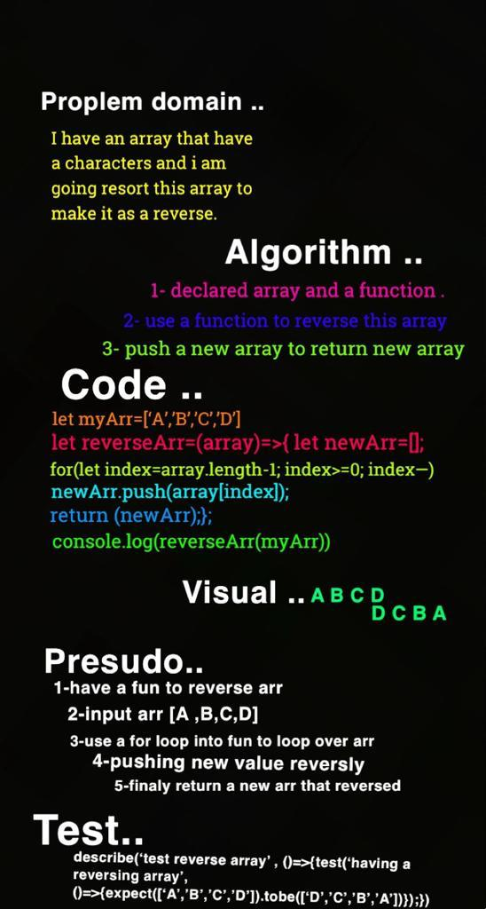

# data-structures-and-algorithms401

# Reverse an Array
<!-- Description of the challenge -->
*Create a function to reverse array*
## Whiteboard Process
<!-- Embedded whiteboard image -->

## Approach & Efficiency
*using for loop to looping throw array that reverse them into a new array*