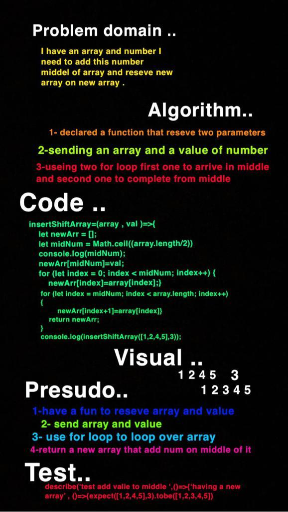

# Insert to Middle of an Array
**I have to create a function that do to insert a number middle of array and return it into a new array**

## Whiteboard Process
<!-- Embedded whiteboard image -->

## Approach & Efficiency
<!-- What approach did you take? Discuss Why. What is the Big O space/time for this approach? -->
**I used an arrow function to reseve two parameter , first one has array of number , second one has a value that need to insert it middle of array , I used two for loop to looping over an array first one to looping on middle second one to complete from middle , and insert a value that have reseved on middle of array after divided length of array of 2.**

