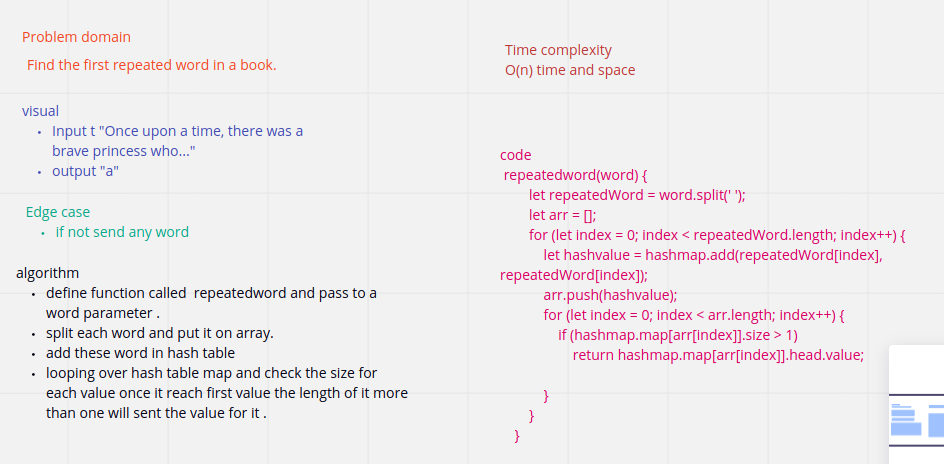

# Challenge Summary
<!-- Description of the challenge -->
Reapeted word on hash table
## Whiteboard Process

## Approach & Efficiency
O(n^2) time and space
## Solution

<!-- Show how to run your code, and examples of it in action -->
