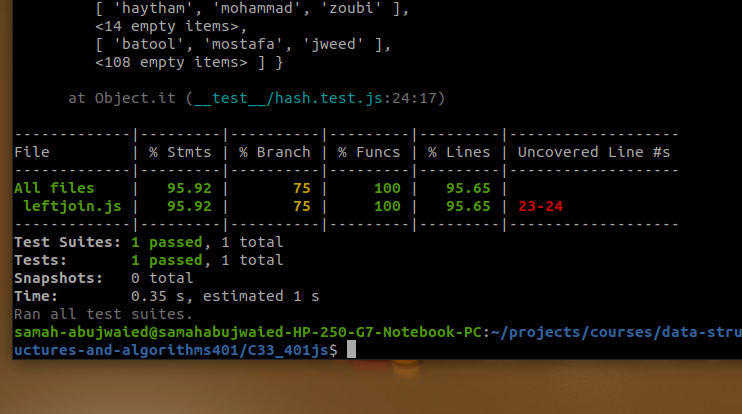

# Challenge Summary
<!-- Description of the challenge -->
**Implement a simplified LEFT JOIN for 2 Hashmaps.**

## Whiteboard Process

## Approach & Efficiency

**O(n) time and space**

## Solution

<!-- Show how to run your code, and examples of it in action -->
