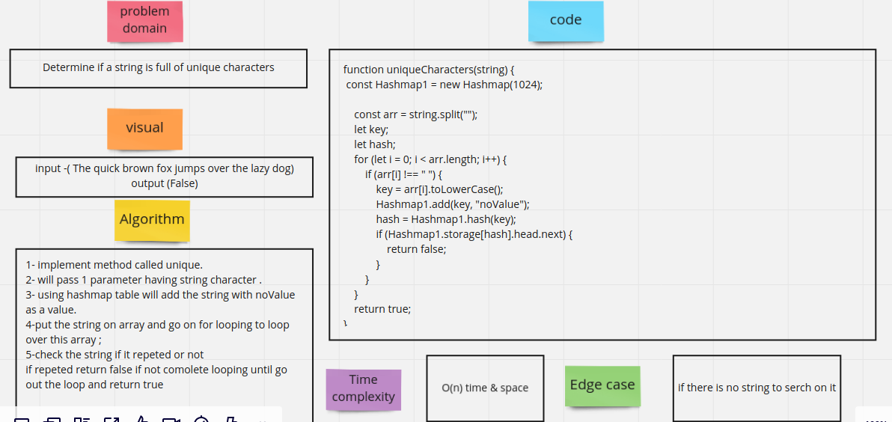
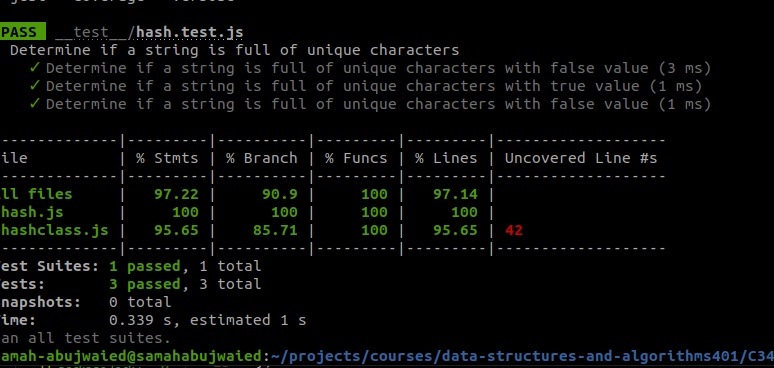

# Challenge Summary
<!-- Description of the challenge -->
**Determine if a string is full of unique characters**

## Whiteboard Process

## Approach & Efficiency

**O(n) time and space**

## Solution

<!-- Show how to run your code, and examples of it in action -->
**Score the candidate according to the**

- With Qasem 

[Whiteboard Rubric](https://docs.google.com/spreadsheets/d/1a5QUyK7qUXnJgfknjTbJSAUc5ne9yIZcWdx1lYegyDE/edit?usp=sharing)
