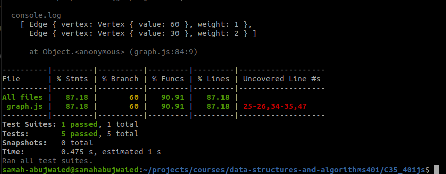

# Challenge Summary
<!-- Description of the challenge -->
- Implement the Graph with the main methods and with :
- AddNode()
- AddEdge()
- GetNodes()
- Size()

## Approach & Efficiency
I created new Map() for adding the vertecies as keys and edges as values to that vertes while these edges link between connected verticies

## API
**AddNode() Adds a new node to the graph Takes in the value of that node Returns the added node AddEdge() Adds a new edge between two nodes in the graph Include the ability to have a “weight” Takes in the two nodes to be connected by the edge Both nodes should already be in the Graph GetNodes() Returns all of the nodes in the graph as a collection (set, list, or similar) GetNeighbors() Returns a collection of edges connected to the given node Takes in a given node Include the weight of the connection in the returned collection Size() Returns the total number of nodes in the graph**

## Test 
