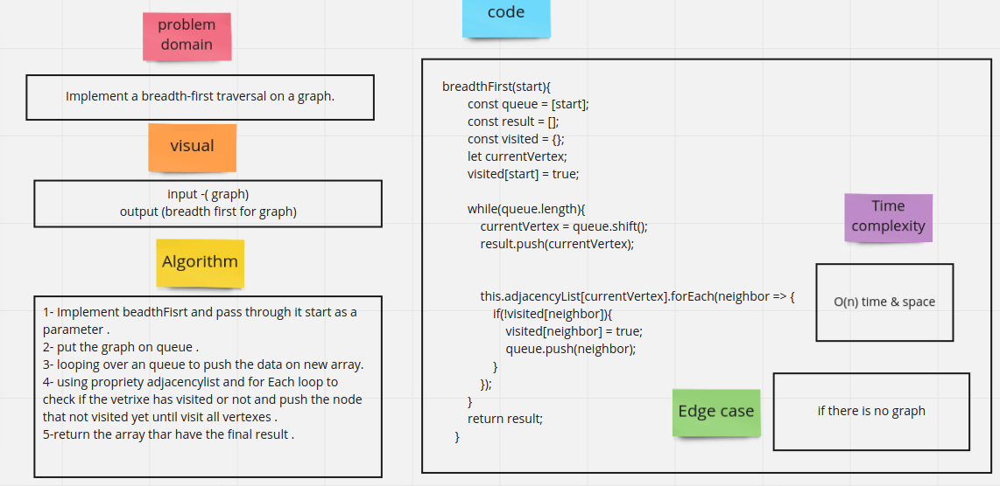
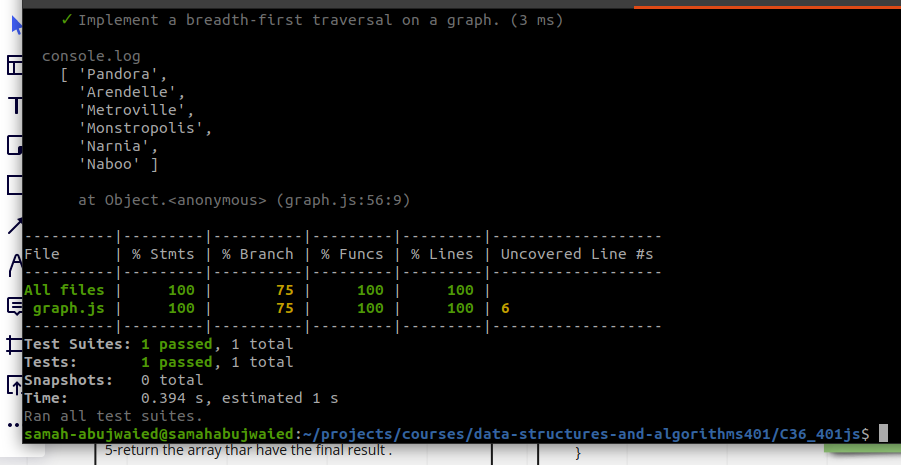

# Challenge Summary
<!-- Description of the challenge -->
- Implement a breadth-first traversal on a graph.

## Whiteboard Process
<!-- Embedded whiteboard image -->

## Solution
<!-- Show how to run your code, and examples of it in action -->

