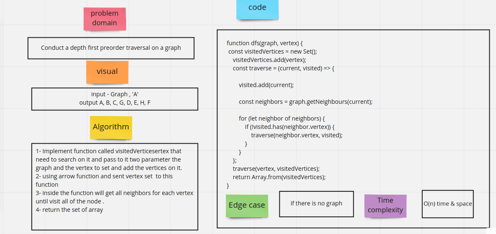
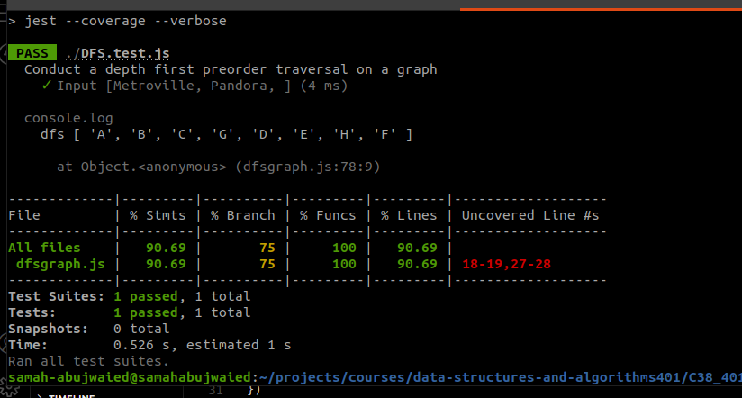

# Challenge Summary
<!-- Description of the challenge -->
- Conduct a depth first preorder traversal on a graph

## Whiteboard Process
<!-- Embedded whiteboard image -->

## Solution
<!-- Show how to run your code, and examples of it in action -->

