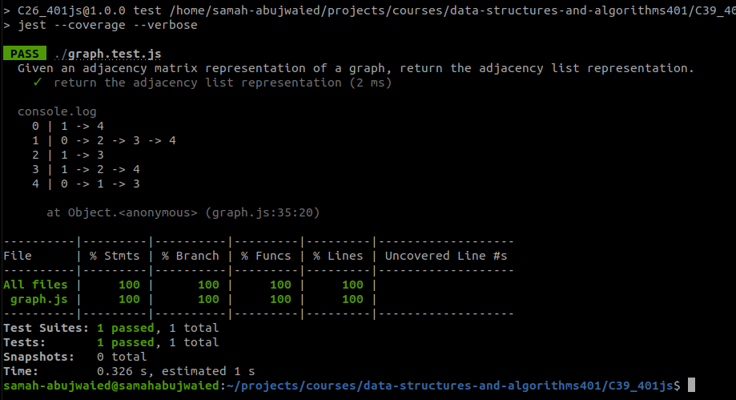

# Challenge Summary
<!-- Description of the challenge -->
- Given an adjacency matrix representation of a graph, return the adjacency list representation.

## Whiteboard Process
<!-- Embedded whiteboard image -->
For Dounia
[whiteBoard](https://docs.google.com/spreadsheets/d/1_638Ed-33Gj1WnY4XKBFGhLlI-eo5E325wASUnoJvMI/edit?usp=sharing)

## Solution
<!-- Show how to run your code, and examples of it in action -->

