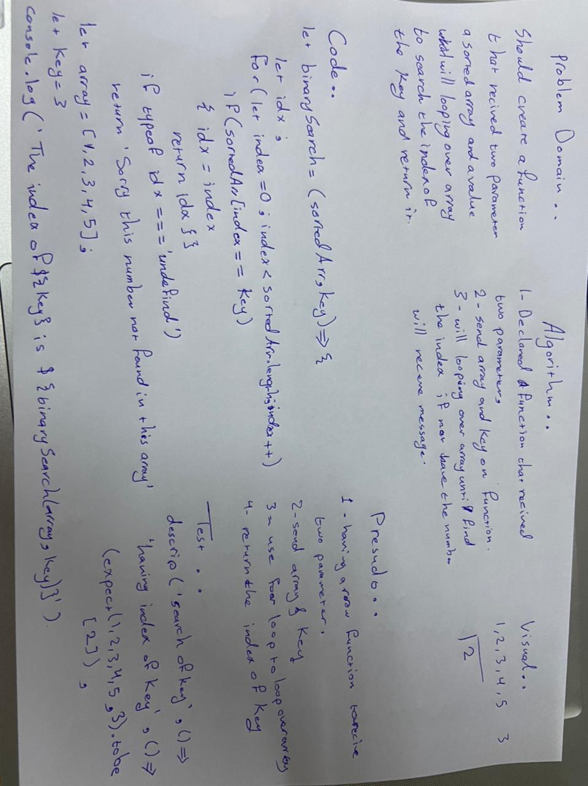

# Binary Search of Sorted Array
<!-- Description of the challenge -->
**Having a function that recieve two parameter first on is an array secound one is a key and should return index of key .**

## Whiteboard Process
<!-- Embedded whiteboard image -->

## Approach & Efficiency
<!-- What approach did you take? Discuss Why. What is the Big O space/time for this approach? -->
**I created an array , key and function the perpose of function to recieve an array and key and then looping over array to find the index of key**