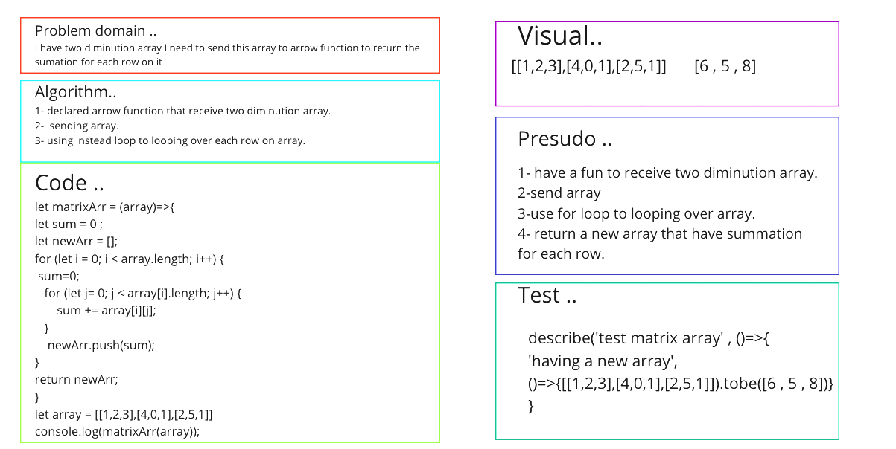

# Binary Search of Sorted Array
<!-- Description of the challenge -->
**Having a function that recieve two dimiuntion array.**

## Whiteboard Process
<!-- Embedded whiteboard image -->

## Approach & Efficiency
<!-- What approach did you take? Discuss Why. What is the Big O space/time for this approach? -->
**I created an array , and then send this array to matrix fun to return back the summation for each row on it**