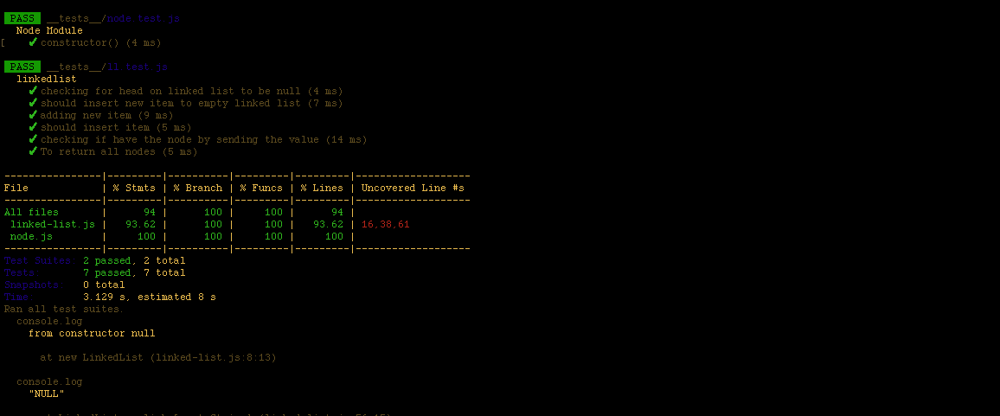

# Singly Linked List
<!-- Short summary or background information -->
**To adding a new node on linked list we should make function to manege these nodes while insarting and when we make a linked list it gave us a best prroach to find any node by ots value**
## Challenge
<!-- Description of the challenge -->
**I am trying to add methods for insert , tostring and inclode to do some checking on theses methods if them work or not to playing around nodes**

## Approach & Efficiency
<!-- What approach did you take? Why? What is the Big O space/time for this approach? -->

## API
<!-- Description of each method publicly available to your Linked List -->
- Insert for insert new node on linked list .
- inclode for checking if the value insert on linked list or not.
- toString to give us all node on linked list.
