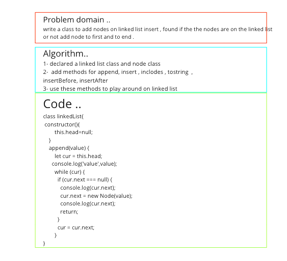
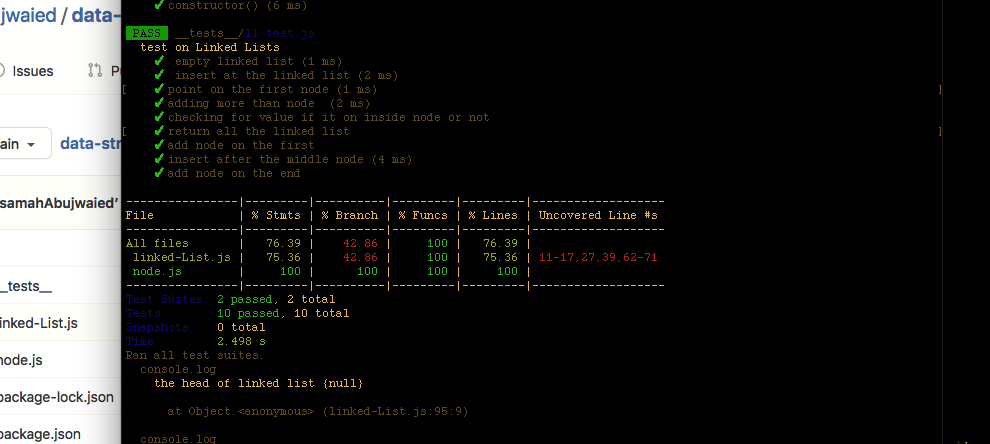

# Challenge Summary
<!-- Description of the challenge -->
**write a class to add nodes on linked list insert , found if the the nodes are on the linked list or not add node to first and to end .**
## Whiteboard Process
<!-- Embedded whiteboard image -->

## Approach & Efficiency
<!-- What approach did you take? Why? What is the Big O space/time for this approach? -->
using class for linked list and node
## Solution
<!-- Show how to run your code, and examples of it in action -->
1- declared a linked list class and node class
2-  add methods for append, insert , inclodes , tostring  , insertBefore, insertAfter
3- use these methods to play around on linked list
