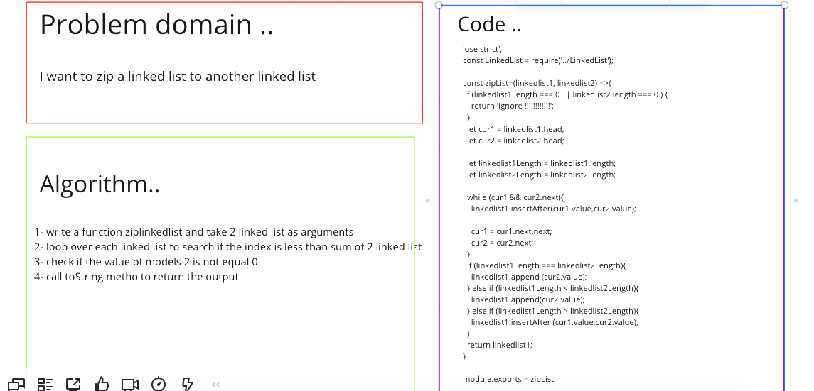

# linked-list-zip

### Challenge:
- Write a function called zip lists take two Arguments: 2 linked lists and eturn: Linked List.

##### Approach
1. I understood the problem first
2. I imagined how the results should be
3. I made a drawings of how the linked list would be after insertion of multiple nodes Linked-List.
4. I wrote the code
5. I made the tests

##### Efficiency

Space : O(n)
Time : O(n^2)

#### API

- zipList(): takes two linked lists as arguments and zip them togther so that the nodes alternate between the two lists and return a reference to the head of the zipped list.

##### Test

npm run test

##### Whiteboard :

