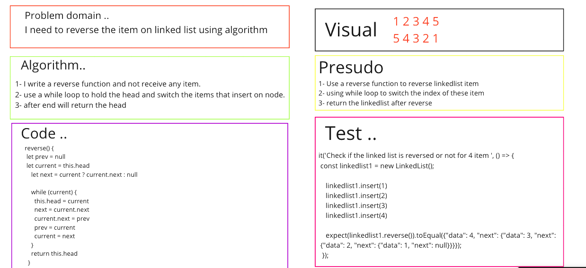
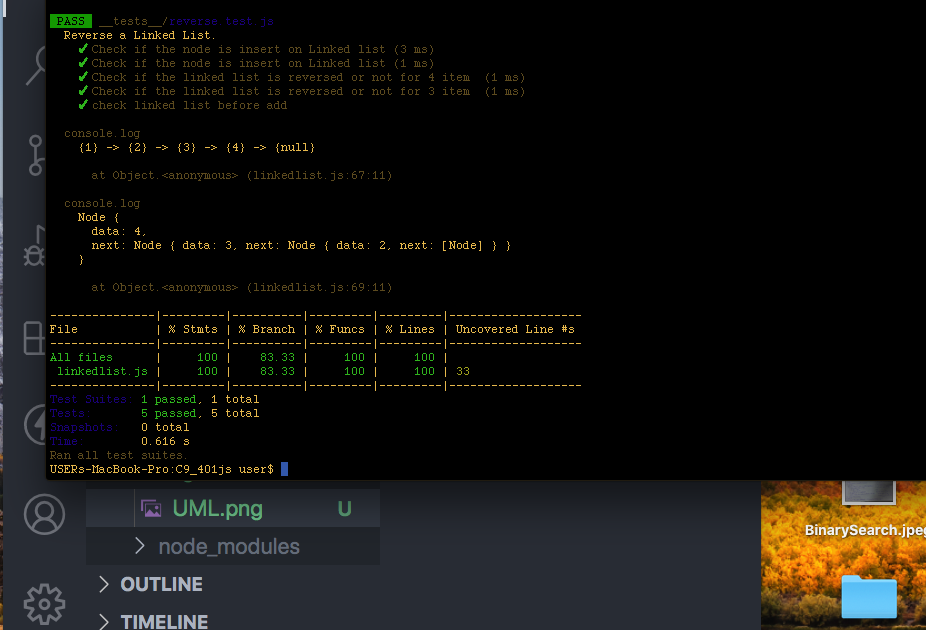

# linked-list-zip

### Challenge:
- Write a REVERSED function to reverse linked list item. 

##### Approach
1. I understood the problem first
2. I imagined how the results should be
3. I made a drawings of how the linked list would be after reverse .
4. I wrote the code
5. I made the tests

##### Efficiency

Space : O(n)
Time : O(1)

##### Test

npm run test

##### Whiteboard :

